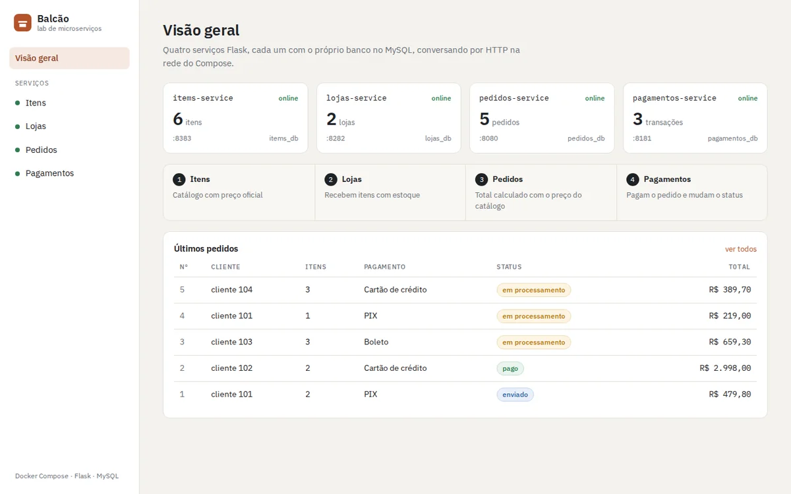
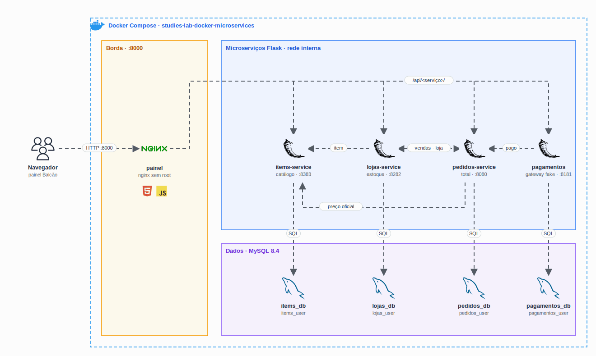

<h1 align="center">
  Lab de Microserviços com Docker: Flask, MySQL e um painel para operar tudo
</h1>

<p align="center">
  
</p>

<p align="center">
  <a href="https://skillicons.dev">
    
  </a>
</p>

## Qual a finalidade do projeto?

Laboratório de estudo de **microserviços em containers**, que nasceu dos estudos na graduação em Cloud da FIAP. É um e-commerce pequeno quebrado em **quatro serviços Flask independentes** (itens, lojas, pedidos e pagamentos), cada um com o **próprio banco no MySQL**, conversando por HTTP dentro da rede do Docker Compose.

Na frente fica o **Balcão**, um painel web servido por nginx que faz de proxy para os serviços e permite operar o fluxo inteiro pelo navegador: cadastrar itens, colocar em estoque nas lojas, fazer pedidos e pagar.

## Arquitetura

<p align="center">
  
</p>

## O que foi construído

### Serviços

| Serviço | Porta | Banco | Responsabilidade |
|---|---|---|---|
| `painel` | **8000** (pública) | · | UI e proxy `/api/<serviço>/` para os microserviços |
| `items-service` | 8383 | `items_db` | Catálogo de itens com o preço oficial |
| `lojas-service` | 8282 | `lojas_db` | Lojas, estoque por item e dashboard de vendas |
| `pedidos-service` | 8080 | `pedidos_db` | Pedidos, itens do pedido, total e status |
| `pagamentos-service` | 8181 | `pagamentos_db` | Formas de pagamento, gateway simulado e histórico |
| `mysql` | interna | 4 bancos | MySQL 8.4, um banco e um usuário por serviço |

As portas dos serviços ficam publicadas só em `127.0.0.1`, para testar cada um direto com `curl`. O MySQL não é publicado.

### Conversas entre os serviços

| Quem chama | Quem responde | Para quê |
|---|---|---|
| `pedidos-service` | `items-service` | Buscar o preço de cada item e calcular o total (o preço nunca vem do cliente) |
| `pedidos-service` | `lojas-service` | Conferir se a loja do pedido existe |
| `lojas-service` | `items-service` | Validar o item associado e trazer nome e preço no dashboard |
| `lojas-service` | `pedidos-service` | Listar as vendas da loja e somar o faturamento |
| `pagamentos-service` | `pedidos-service` | Ler o valor do pedido e marcar como `pago` |

Se um serviço cair, quem depende dele responde `503` (ou avisa no dashboard) em vez de quebrar.

### Rotas

| Serviço | Rotas |
|---|---|
| items | `GET/POST /itens` · `GET/PUT/DELETE /itens/<id>` |
| lojas | `GET/POST /lojas` · `GET/PUT/DELETE /lojas/<id>` · `POST /produtos_lojas` · `GET /dashboard/<loja_id>` · `GET /historico` |
| pedidos | `GET/POST /pedidos` (`?loja_id=`) · `GET /pedidos/<id>` · `PUT /pedidos/<id>/status` · `GET /clientes/<cliente_id>/pedidos` |
| pagamentos | `GET/POST /formas_pagamento` · `POST /pagamentos` · `GET /pagamentos/<id>` · `POST /pagamentos/<id>/confirmar` · `GET /historico` |
| todos | `GET /` (lista as rotas) · `GET /status` (healthcheck com teste do banco) |

Status do pedido: `em processamento` → `pago` → `enviado` → `entregue` (ou `cancelado`). No gateway simulado, cartão e PIX aprovam na hora e o boleto fica `pendente` até ser confirmado.

### Containers

| Ponto | Como ficou |
|---|---|
| Imagens | `python:3.12-slim` com gunicorn; painel em `nginx-unprivileged` |
| Usuário | Nenhum container de aplicação roda como root (`app` uid 10001 e `nginx` uid 101) |
| Healthcheck | Todos: `/status` nos serviços (inclui o banco), `/healthz` no painel, `mysqladmin ping` no MySQL |
| Ordem de subida | Serviços esperam o MySQL saudável; o painel espera os 4 serviços |
| Senhas | Só no `.env` (fora do git); a compose não sobe sem elas |
| Isolamento | Cada serviço só tem permissão no próprio banco |

## Tecnologias utilizadas

- **Docker e Docker Compose:** 6 containers, rede interna e volume do MySQL;
- **Python 3.12 + Flask 3 + gunicorn:** os quatro microserviços;
- **PyMySQL:** acesso ao banco, com transação na criação do pedido;
- **MySQL 8.4:** um banco e um usuário por serviço, criados por script de init;
- **nginx:** painel estático e proxy reverso com o DNS interno do Docker;
- **HTML, CSS e JavaScript puros:** o painel, sem framework;
- **GitHub Actions + ruff:** lint e teste de ponta a ponta a cada push.

## Estrutura do repositório

```text
studies-lab-docker-microservices/
├── services/
│   ├── items-service/        # app.py, db.py, Dockerfile, requirements.txt
│   ├── lojas-service/        # + servicos.py (chamadas HTTP aos outros)
│   ├── pedidos-service/
│   └── pagamentos-service/
├── painel/
│   ├── public/               # index.html, styles.css, app.js
│   ├── nginx.conf            # proxy /api/<serviço>/
│   └── Dockerfile
├── mysql/init/               # cria os 4 bancos e usuários na primeira subida
├── scripts/
│   ├── seed.py               # dados de exemplo
│   └── smoke_test.py         # teste de ponta a ponta (52 verificações)
├── docker-compose.yml
├── .env.example
├── .github/workflows/ci.yml
└── docs/                     # arch.gif e demo.webp
```

## Fluxo de funcionamento

1. O navegador abre o painel em `:8000`; o JavaScript chama `/api/<serviço>/...` e o nginx repassa para o container certo.
2. Um item é cadastrado no `items-service` e associado a uma loja com estoque no `lojas-service`, que confere se o item existe.
3. No pedido, o `pedidos-service` busca o preço de cada item no `items-service`, calcula o total e grava pedido e itens numa transação.
4. O `pagamentos-service` lê o pedido, simula o gateway e, quando aprova, muda o status do pedido para `pago`. O boleto só muda depois do `confirmar`.
5. O dashboard da loja junta o estoque (com nome e preço do catálogo) e as vendas vindas do `pedidos-service`, somando o faturamento dos pedidos pagos, enviados e entregues.

## Como rodar

```bash
cp .env.example .env              # troque as senhas (letras e números)
docker compose up -d --build --wait
python3 scripts/seed.py           # opcional: itens, lojas, pedidos e pagamentos de exemplo
```

| Endereço | O quê |
|---|---|
| http://localhost:8000 | Painel Balcão |
| http://localhost:8000/api/items/itens | Qualquer rota pelo proxy |
| http://127.0.0.1:8383/itens | Direto no serviço (8282, 8080 e 8181 para os outros) |

Exemplo pelo terminal:

```bash
curl -s -X POST localhost:8000/api/items/itens -H 'Content-Type: application/json' \
  -d '{"nome": "Teclado", "preco": 199.9}'
curl -s -X POST localhost:8000/api/pedidos/pedidos -H 'Content-Type: application/json' \
  -d '{"cliente_id": 1, "forma_pagamento": "pix", "itens": [{"produto_id": 1, "quantidade": 2}]}'
curl -s -X POST localhost:8000/api/pagamentos/pagamentos -H 'Content-Type: application/json' \
  -d '{"pedido_id": 1, "forma_pagamento": "pix"}'
```

Para parar: `docker compose down` (os dados ficam no volume). Para apagar os dados também: `docker compose down -v`.

## Como validar a entrega

```bash
python3 scripts/smoke_test.py     # com a stack no ar
```

O teste passa pelo painel e faz 52 verificações, entre elas:

- os 4 serviços online e com banco;
- CRUD de itens e lojas, associação com estoque e histórico;
- total do pedido calculado com o preço do `items-service`, e `422` para item ou loja que não existem;
- PIX e cartão aprovando e marcando o pedido como `pago`, cartão mascarado, boleto pendente até a confirmação;
- `409` ao pagar um pedido já pago;
- dashboard da loja somando o faturamento dos pedidos pagos.

O mesmo teste roda no GitHub Actions a cada push, com senhas geradas na hora.

## Autor

**William Coelho** · RM 556336 · [@willtechdev](https://github.com/willtechdev)
